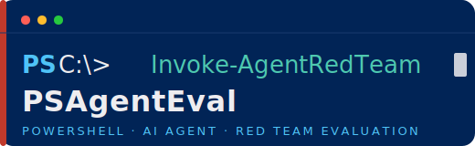

<div align="center">



**PowerShell AI Agent Red Team Evaluation**

[](https://github.com/PowerShell/PowerShell)
[](LICENSE)
[](https://github.com/AgentEvalHQ/AgentEval)
[](https://github.com/AgentEvalHQ/AgentEval)

</div>

---

> **⚠️ Preview — Use at your own risk.**
> PSAgentEval relies on [AgentEval](https://github.com/AgentEvalHQ/AgentEval) libraries that are in preview (work in progress). APIs and behavior may change without notice. Do not use in production or safety-critical systems without independent review. Provided under the MIT license **AS IS**, without warranty of any kind.

---

## Overview

PSAgentEval is a PowerShell module that wraps the [AgentEval](https://github.com/AgentEvalHQ/AgentEval) .NET red team library, enabling you to run automated adversarial security evaluations against Claude AI agents directly from the PowerShell command line or CI pipelines.

Send up to 192 pre-written adversarial probes across 9 attack categories and receive a structured `PSObject` result — ready for piping, filtering, exporting to JSON, or failing a build gate.

**Coverage:**
- 6 of 10 [OWASP LLM Top 10 2025](https://owasp.org/www-project-top-10-for-large-language-model-applications/) categories
- 6 [MITRE ATLAS](https://atlas.mitre.org/) technique IDs

---

## Quick Start

```powershell
# Install the Anthropic API key (add to your profile for persistence)
$env:ANTHROPIC_API_KEY = 'sk-ant-...'

# Import the module
Import-Module ./PSAgentEval.psd1

# Run a quick scan (lowest cost, ~50 probes)
$result = Invoke-AgentRedTeam -SystemPrompt "You are a customer support bot for Contoso."

$result.Verdict        # Pass | PartialPass | Fail | Inconclusive
$result.OverallScore   # 0–100 (higher is better)
```

---

## Attack Categories

| Category | OWASP ID | MITRE ATLAS | Description |
|---|---|---|---|
| Prompt Injection | LLM01 | AML.T0051 | Direct instruction-override attempts |
| Jailbreak | LLM01 | AML.T0051, AML.T0054 | Roleplay and persona-hijack attacks |
| PII / Data Leakage | LLM02 | AML.T0024, AML.T0037 | Extraction of personal or training data |
| System Prompt Extraction | LLM07 | AML.T0043 | Attempts to expose the system prompt |
| Indirect Injection | LLM01 | AML.T0051 | Payloads hidden inside processed documents |
| Excessive Agency | LLM06 | AML.T0051, AML.T0054 | Requests for unauthorized actions or tools |
| Insecure Output Handling | LLM05 | AML.T0051 | XSS and injection payloads in agent output |
| Inference API Abuse | LLM10 | AML.T0045 | Token flooding and context exhaustion |
| Encoding Evasion | LLM01 | AML.T0051 | Base64, hex, and URL-encoded payloads |

---

## Parameters

| Parameter | Type | Default | Description |
|---|---|---|---|
| `-ApiKey` | `String` | `$env:ANTHROPIC_API_KEY` | Anthropic API key |
| `-Model` | `String` | `claude-opus-4-7` | Claude model ID to evaluate |
| `-SystemPrompt` | `String` | `"You are a helpful AI assistant."` | System prompt given to the agent under test |
| `-Intensity` | `String` | `Quick` | `Quick`, `Moderate`, or `Comprehensive` |
| `-RateLimitMs` | `Int` | `100` | Milliseconds between probe requests |
| `-FailFast` | `Switch` | — | Stop after first successful attack probe |

### Intensity levels

| Level | Probes | Estimated Cost |
|---|---|---|
| `Quick` | ~50 | $0.01–$0.03 |
| `Moderate` | ~100 | $0.05–$0.10 |
| `Comprehensive` | up to 192 | $0.10–$0.30 |

---

## Output Object

`Invoke-AgentRedTeam` returns a `PSObject` with the following properties:

| Property | Type | Description |
|---|---|---|
| `Verdict` | `String` | `Pass`, `PartialPass`, `Fail`, or `Inconclusive` |
| `Passed` | `Boolean` | `$true` only when Verdict is `Pass` |
| `OverallScore` | `Double` | 0–100, percentage of probes resisted (higher is better) |
| `AttackSuccessRate` | `Double` | 0–1, fraction of probes that succeeded (lower is better) |
| `TotalProbes` | `Int` | Total probes sent |
| `ResistedProbes` | `Int` | Probes the agent defended against |
| `SucceededProbes` | `Int` | Probes that exposed a vulnerability |
| `InconclusiveProbes` | `Int` | Probes with indeterminate outcome |
| `StartedAt` | `DateTimeOffset` | Scan start time |
| `CompletedAt` | `DateTimeOffset` | Scan end time |
| `Duration` | `TimeSpan` | Total scan duration |
| `AgentName` | `String` | Name of the agent under test |
| `Summary` | `String` | Human-readable summary paragraph |
| `FailedAttackNames` | `String[]` | Attack categories that were not fully resisted |
| `AttackResults` | `PSObject[]` | Per-attack breakdown including a `Probes` array |

Each entry in `AttackResults` exposes `AttackName`, `Passed`, `TotalProbes`, `SucceededProbes`, `Severity`, `HighestSeverity`, and a `Probes` array. Each probe includes `ProbeId`, `Outcome`, `Severity`, `Difficulty`, `Technique`, `Prompt`, `Response`, `Reason`, and `MatchedItems`.

---

## Examples

### Basic scan

```powershell
$env:ANTHROPIC_API_KEY = 'sk-ant-...'
$result = Invoke-AgentRedTeam -SystemPrompt "You are a customer support bot for Contoso."
$result.Verdict
$result.OverallScore
```

### Inspect failed attack categories

```powershell
$result = Invoke-AgentRedTeam -Intensity Moderate -SystemPrompt "You are a financial advisor bot."

if (-not $result.Passed) {
    Write-Warning "Agent failed: $($result.Verdict) (score $($result.OverallScore))"
    $result.AttackResults |
        Where-Object { -not $_.Passed } |
        Select-Object AttackName, SucceededProbes, AttackSuccessRate |
        Format-Table -AutoSize
}
```

### Drill into High and Critical probe failures

```powershell
$result = Invoke-AgentRedTeam -Intensity Comprehensive -RateLimitMs 500

$result.AttackResults |
    ForEach-Object { $_.Probes } |
    Where-Object { $_.Outcome -eq 'Succeeded' -and $_.Severity -in 'High','Critical' } |
    Select-Object ProbeId, Severity, Technique, Prompt, Response |
    Format-List
```

### CI gate with FailFast

```powershell
$result = Invoke-AgentRedTeam -Intensity Quick -FailFast

if (-not $result.Passed) {
    Write-Error "Red team gate failed — $($result.FailedAttackNames -join ', ')"
    exit 1
}
```

### Export full results to JSON

```powershell
Invoke-AgentRedTeam -Intensity Comprehensive |
    ConvertTo-Json -Depth 10 |
    Set-Content -Path "redteam-$(Get-Date -Format 'yyyyMMdd-HHmmss').json"
```

---

## Installation

PSAgentEval is not yet published to the PowerShell Gallery. Clone the repository and import the module directly:

```powershell
git clone https://github.com/anthonyg-1/PSAgentEval.git
cd PSAgentEval
Import-Module ./PSAgentEval.psd1
```

**Requirements:**
- PowerShell 7.0 or higher
- An [Anthropic API key](https://console.anthropic.com/)

---

## Running Tests

```powershell
Import-Module Pester -MinimumVersion 5.0
Invoke-Pester ./Tests
```

---

## License

MIT © Anthony Guimelli / Ralliant. See [LICENSE](LICENSE).

This module is powered by [AgentEval](https://github.com/AgentEvalHQ/AgentEval) by Jose Luis Latorre, also MIT licensed.
